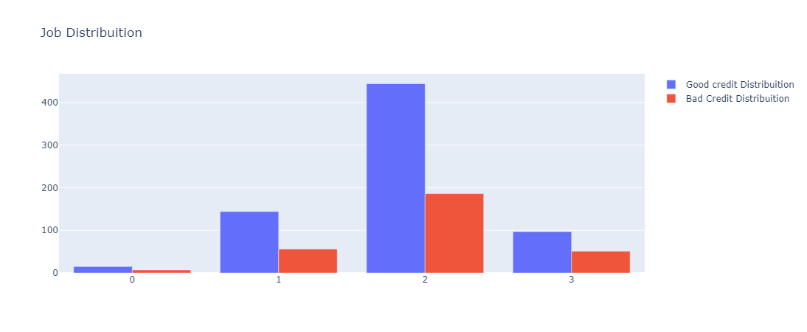
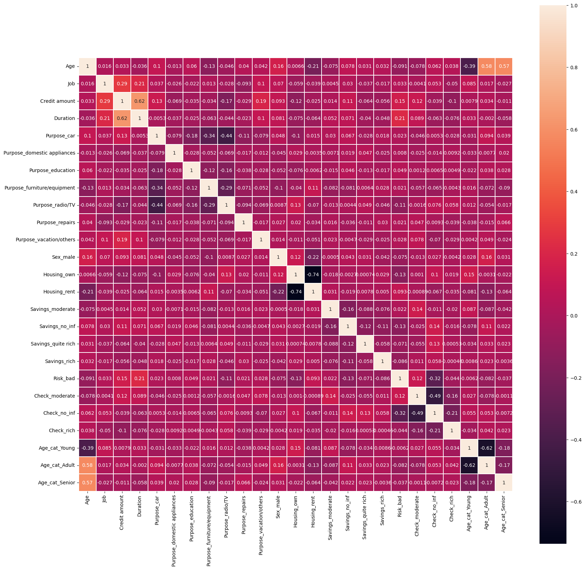
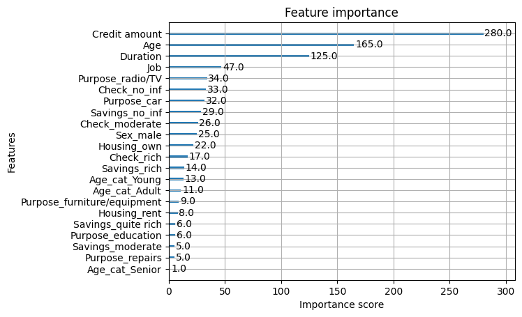
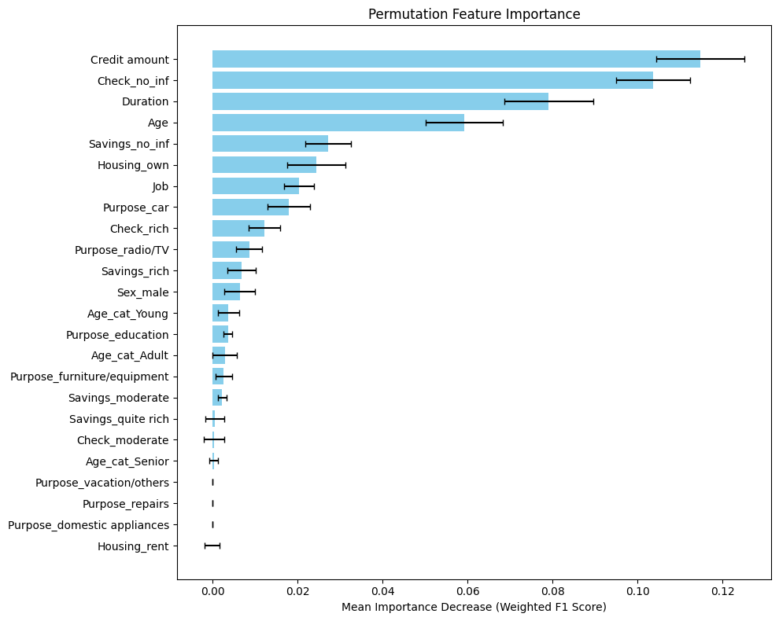
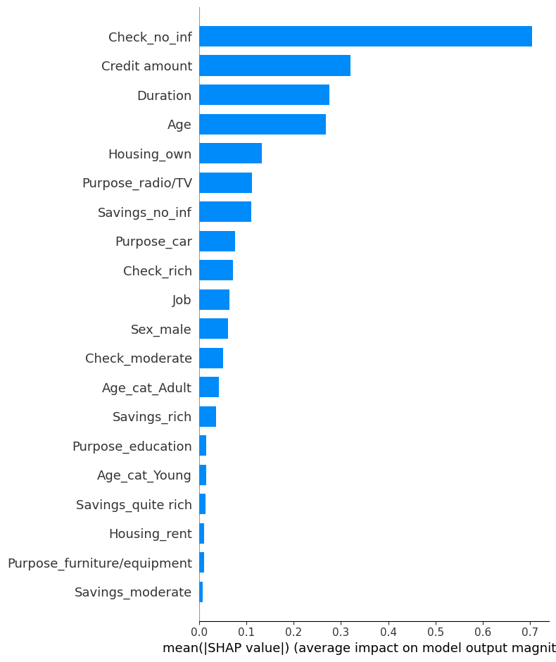

# 💳 German Credit Risk Prediction & Explainability

Created by Saksham Sharma

This repository contains a comprehensive data science project focused on predicting credit risk using the German Credit Card Dataset. It covers the entire pipeline from Exploratory Data Analysis (EDA) and data preprocessing to model training, rigorous evaluation (with a focus on imbalanced data), and in-depth model interpretability using various feature importance techniques.

The goal is not just to build a predictive model, but also to understand *why* it makes certain decisions, providing valuable, actionable insights for credit evaluation processes.

[**Project Report**](https://alexfierro9.github.io/German-Credit-EDA/Report.html)

[**Video based Project Demo**](https://youtu.be/m9oxpmG2RTA)

## 🌟 Project Highlights

*   **Comprehensive EDA:** Deep dive into the dataset to uncover distributions, relationships, and patterns across various features (Age, Credit Amount, Duration, Housing, Job, Purpose, Savings, Checking Account Status, Sex) in relation to credit risk.
*   **Robust Preprocessing:** Handling missing values and transforming categorical data for model readiness.
*   **Powerful Modeling:** Implementation of a highly effective XGBoost classifier, known for its performance on tabular data.
*   **Rigorous Evaluation:** Moving beyond simple accuracy to focus on metrics critical for imbalanced datasets (Precision, Recall, F1-score, Confusion Matrix). Detailed explanation of *why* these metrics are essential in a credit risk context.
*   **Model Explainability (XAI):** Understanding the model's decision-making process using:
    *   XGBoost's internal feature importance.
    *   Permutation Feature Importance (model-agnostic).
    *   SHapley Additive exPlanations (SHAP) for both global and local insights.
*   **Actionable Insights:** Deriving practical takeaways from feature importance analysis to inform and potentially improve real-world credit assessment strategies.
*
## 🎯 Problem Definition

Credit risk assessment is a fundamental challenge for financial institutions. Accurately predicting whether a loan applicant is likely to default ('Bad Credit') or repay ('Good Credit') is vital for financial stability and responsible lending. The German Credit Dataset presents this binary classification problem with features describing borrower demographics, financial status, and loan characteristics. A key challenge is the dataset's class imbalance (more 'Good' than 'Bad' credit instances), which requires careful model evaluation and interpretation.

## 📊 Dataset

The project utilizes the **German Credit Dataset** from the UCI Machine Learning Repository.
*   **Source:** [UCI Machine Learning Repository: German Credit Data](https://archive.ics.uci.edu/ml/datasets/statlog+(german+credit+data))
*   **Instances:** 1000
*   **Features:** 20 (mixture of numerical and categorical) + 1 target variable ('Risk').
*   **Target Variable:** 'Risk' (Good Credit vs. Bad Credit).
*   **Key Characteristic:** The dataset is imbalanced, with a majority of instances belonging to the 'Good Credit' class.

## 🔍 Exploratory Data Analysis (EDA)

The notebook includes an in-depth EDA section, exploring the relationships between various features and the target variable for the purpose of code reproducability.

A project report viewable on web browsers with interactive graphs is also made available.

*   **Initial Look:** Data types, missing values, and unique values.
*   **Target Variable Distribution:** Visualization of the class imbalance.
*   **Age Analysis:** Distribution of age by credit risk, including grouping ages into categories for further analysis.
*   **Housing Status Analysis:** Credit amount and age distributions by housing status and risk.
*   **Sex Distribution:** Counts and credit amount distributions by sex and risk.
*   **Job Category Analysis:** Counts, credit amount, and age distributions by job category and risk.
*   **Purpose of Loan:** Counts, age, and credit amount distributions by loan purpose and risk.
*   **Duration of Loan:** Counts, average credit amount, and distribution frequency by loan duration and risk.
*   **Savings and Checking Account Status:** Distribution of counts, credit amount, and age by savings and checking account status and risk.
*   **Correlation Heatmap:** Visualization of linear correlations between numerical and one-hot encoded categorical features.

<p align="center">
  
</p>


**Key EDA Findings:**
*   The dataset is indeed imbalanced, with ~70% Good Credit and ~30% Bad Credit instances.
*   Features like `Credit amount`, `Duration`, `Age`, `Checking account status`, and `Housing` show notable patterns related to credit risk.
*   Interestingly, borrowers with 'Bad Credit' sometimes tend to have applied for higher credit amounts or longer durations for certain categories compared to 'Good Credit' borrowers in the same category.
*   The 'no checking account' status seems strongly linked to higher risk.

## 🧹 Data Preprocessing

The preprocessing steps prepared the data for the machine learning model:

*   **Missing Value Imputation:** Missing values in 'Saving accounts' and 'Checking account' were handled by filling them with a new category like 'no_info' or 'no_checking'. (Based on your code, you filled with 'no_inf').
*   **Categorical Feature Encoding:** One-Hot Encoding was applied to all remaining categorical features to convert them into a numerical format suitable for XGBoost.
*   **Target Variable Encoding:** The 'Risk' variable was encoded (e.g., Good=0, Bad=1).
*   **Feature and Target Split:** The dataset was split into features (X) and the target variable (y).
*   **Train-Test Split:** The data was divided into training and testing sets (e.g., 75% train, 25% test).

## 🤖 Model Training

*   **Model Choice:** **XGBoost (Extreme Gradient Boosting)** was selected due to its proven performance on tabular data, robustness to multicollinearity, handling of non-linear relationships, built-in regularization, and feature importance capabilities.
*   **Hyperparameter Tuning:** `GridSearchCV` was used to find the optimal hyperparameters for the XGBoost classifier, maximizing the weighted F1-score on the cross-validation folds.
*   **Training:** The XGBoost model was trained on the preprocessed training data.

## 📈 Model Evaluation

Given the imbalanced nature of the dataset, evaluation focused on metrics beyond simple accuracy:

*   **Confusion Matrix:** Visualizing True Positives, True Negatives, False Positives, and False Negatives.
*   **Classification Report:** Providing Precision, Recall, and F1-score for both the 'Good' and 'Bad' credit classes, as well as overall accuracy and weighted/macro averages.

<p align="center">
  
</p>

**Evaluation Results:**
*   **Cross-Validation Weighted F1-score:** `0.7376` (Achieved during Grid Search on training data).
*   **Test Set Weighted F1-score:** `0.7224` (Evaluation on unseen test data).
*   **Test Set Classification Report:**

    ```
                  precision    recall  f1-score   support

            Good       0.78      0.90      0.83       178
             Bad       0.59      0.36      0.45        72

        accuracy                           0.74       250
       macro avg       0.68      0.63      0.64       250
    weighted avg       0.72      0.74      0.72       250
    ```
**Interpretation:**
*   The overall accuracy is 74%, but this is inflated by the majority class.
*   The model achieves a decent F1-score of 0.83 for the 'Good' class, primarily driven by high recall (correctly identifying 90% of actual Good cases).
*   For the crucial 'Bad' class (minority), the precision is 0.59 (meaning 59% of predictions labeled as 'Bad' were actually 'Bad'), and the recall is 0.36 (meaning it only correctly identified 36% of the actual 'Bad' cases). The F1-score for the 'Bad' class is 0.45.
*   While the weighted F1-score of 0.72 reflects the overall performance considering class imbalance, there is still room for improvement in detecting the 'Bad Credit' instances (low recall for the 'Bad' class). Further work could involve techniques specifically addressing class imbalance during training (e.g., SMOTE, adjusting class weights).

## 🧠 Model Interpretability (XAI)

Understanding *why* the model makes predictions is crucial in credit risk. Various methods were used to gain insights into feature importance:

1.  **XGBoost Internal Feature Importance:** Based on metrics like "Gain" or "Weight" within the tree structure during training.
2.  **Permutation Feature Importance:** Measures the decrease in model performance (weighted F1-score) when a feature's values are randomly shuffled on the test set. A larger decrease indicates higher importance.
3.  **SHapley Additive exPlanations (SHAP):** A game-theory approach that assigns an importance value to each feature for each prediction, explaining its contribution to the final output. Aggregating SHAP values provides global feature importance and direction of impact.
<p align="center">
  
  <br>
  <em>XGB Internal Feature Importance</em>
</p>
<p align="center">
  
  <br>
  <em>Permutation Feature Importance (Impact on Weighted F1 Score)</em>
</p>
<p align="center">
  
  <br>
  <em>SHAP Summary Plot (Overall Impact and Direction)</em>
</p>

**Key Interpretability Findings (Consistent across methods):**
The most consistently important features driving the model's predictions are:

1.  **Credit amount:** Higher amounts strongly increase predicted risk.
2.  **Checking account status (especially 'no_inf' / no info):** Having no information about the checking account is a strong indicator of higher risk.
3.  **Duration:** Longer loan durations increase predicted risk.
4.  **Age:** Younger applicants tend to be associated with higher risk.

Other features like `Housing_own`, `Sex_male`, `Job`, and certain `Purpose` categories show moderate importance. Features like Savings account status generally have lower influence in this model.

This analysis confirms intuitive risk factors and highlights the critical role of checking account information.

## 🚀 How to Get Started

To run this project locally:

1.  **Clone the repository:**
    ```bash
    git clone https://github.com/AlexFierro9/German-Credit-EDA.git
    cd German-Credit-EDA
    ```
2.  **Create and activate a virtual environment (recommended):**
    ```bash
    # Using venv
    python -m venv venv
    # On Windows
    .\venv\Scripts\activate
    # On macOS/Linux
    source venv/bin/activate
    ```
3.  **Install dependencies:**
    ```bash
    pip install -r requirements.txt
    ```
4.  **Run the Jupyter Notebook:**
    Open the notebook in your preferred Jupyter environment (Jupyter Lab, VS Code, etc.) and run the cells sequentially to reproduce the analysis and model training.
## 🛠️ Dependencies

*   `pandas`
*   `numpy`
*   `seaborn`
*   `matplotlib`
*   `plotly`
*   `scikit-learn`
*   `xgboost`
*   `shap`
All dependencies are listed in `requirements.txt`.

## 📹 Demo

A video demo showcasing the notebook analysis is available here:

[Link to Demo Recording]

## 🙏 Acknowledgements

*   The German Credit Dataset is made available by the UCI Machine Learning Repository.
*   Thanks to the developers of the open-source libraries used in this project (pandas, numpy, scikit-learn, xgboost, shap, seaborn, matplotlib, plotly).
---